# slab allocator 设计文档及约束规范

## 1. 整体设计

Slab allocator 主要用于解决频繁申请和释放固定大小对象带来的效率问题。

传统内存分配器每次申请对象时，都需要经过页分配器，导致：

- 分配速度慢
- 内部碎片增加
- 缺少对象复用机制

Slab allocator 通过提前建立对象缓存，将同类型对象集中管理。

整体结构如下：

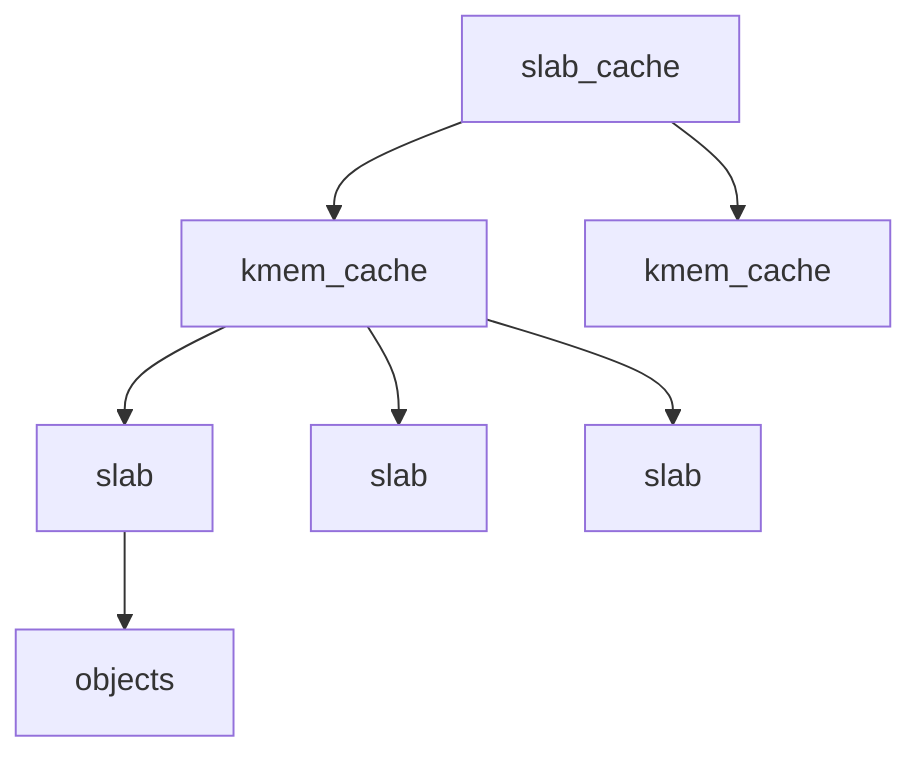

其中：

- `slab_cache`：全局管理所有 cache
- `kmem_cache`：管理某一种对象类型的缓存
- `kmem_slab`：管理一组连续页空间
- `object`：实际分配给用户使用的对象

---

## 2. slab.h 设计

### 2.1 kmem_cache 设计

每一种对象拥有独立的 `kmem_cache`。

例如：

```
inode_cache
task_cache
socket_cache
```

每个 cache 负责：

- 对象大小管理
- 对齐要求
- 对象初始化 / 对象销毁
- slab 生命周期管理

同时，根据论文设计：

> 每一个 kmem_cache 提供独立锁，保证多个 CPU 并发访问时的数据一致性。

最终设计：

```c
struct kmem_cache {
    char name[32];

    uint64 obj_size;
    uint64 slab_size;

    int align;

    struct spinlock lock;

    void (*constructor)(void *, uint64);
    void (*destructor)(void *, uint64);

    struct list_head slabs_full;
    struct list_head slabs_partial;
    struct list_head slabs_empty;

    struct list_head cache_list;
};
```

---

### 2.2 slab 状态管理

为了提高查找效率，一个 cache 维护三个链表：

```
slabs_full      所有对象均被占用
slabs_partial   部分对象被占用
slabs_empty     所有对象均空闲
```

状态转换：

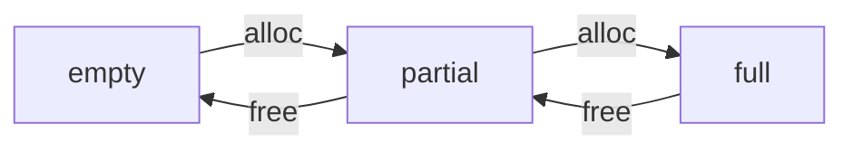

通过三个链表，可以快速找到：

- 可分配对象
- 可回收 slab
- 完全占用 slab

避免遍历所有 slab。

---

### 2.3 kmem_slab 设计

`kmem_slab` 是管理连续页空间的基本单位。

论文指出：由于对象大小通常不能完全填满 page，会产生剩余空间。

例如：

```
PAGE_SIZE = 4096
object    = 24B

4096 / 24 → 存在剩余空间
```

为了提高利用率，将 slab 管理结构放置在 page 尾部：

```
+--------------------------------+
|                                |
|             objects            |
|                                |
|                                |
|------------------------------- |
|           kmem_slab            |
+--------------------------------+
```

因此通过对象地址可以快速定位 slab：

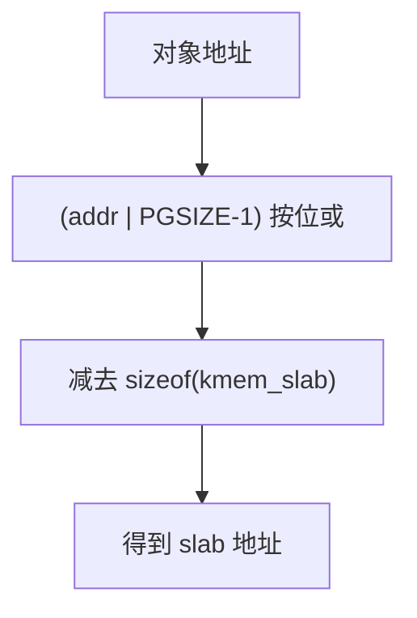

最终设计：

```c
struct kmem_slab {
    void *mem;

    uint32 total_objs;
    uint32 free_objs;

    struct kmem_bufctl *freelist;

    struct list_head list;
};
```

其中：

- `mem`：记录该 slab 对应 page 起始地址，用于释放
- `total_objs`：记录该 slab 可以存放对象数量
- `free_objs`：记录当前剩余对象数量
- `freelist`：记录空闲对象链表
- `list`：用于挂入 `kmem_cache.slabs_xxx` 链表

---

### 2.4 kmem_bufctl 设计

由于对象未被使用时，其空间可以复用，因此将对象自身作为链表节点：

```
free object:
+----------------+
| next pointer   |
+----------------+
```

设计：

```c
struct kmem_bufctl {
    struct kmem_bufctl *next;
};
```

该方式称为：

> Inline freelist

优点：

- 不需要额外分配管理空间
- 提高空间利用率

约束：由于 `next` 为指针，64 位系统下 `sizeof(pointer) = 8B`，因此必须满足：

```
obj_size ≥ 8
```

否则 next 指针无法安全存储，会造成对象覆盖。

---

## 3. slab.c 实现

### 3.1 slab_init

初始化全局 slab 管理结构。

流程：

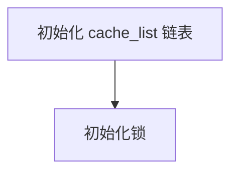

用于保存所有创建的 `kmem_cache`。

---

### 3.2 kmem_cache_create

功能：创建新的对象缓存。

流程：

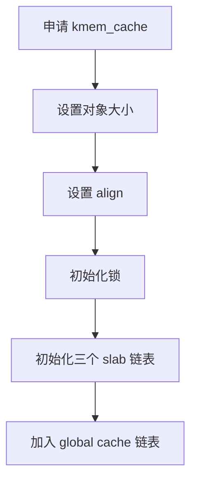

#### obj_size 约束

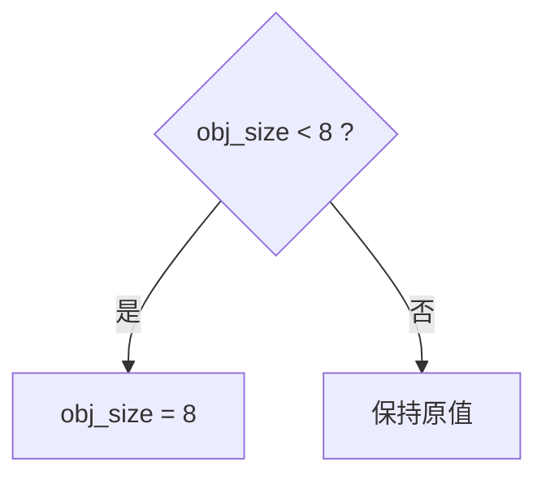

原因：保证 `kmem_bufctl` 可以安全存储（next 指针为 8 字节）。

#### align 约束

align 表示对象地址对齐要求，必须为 2 的幂。例如：8 byte alignment、16 byte alignment。

处理流程：

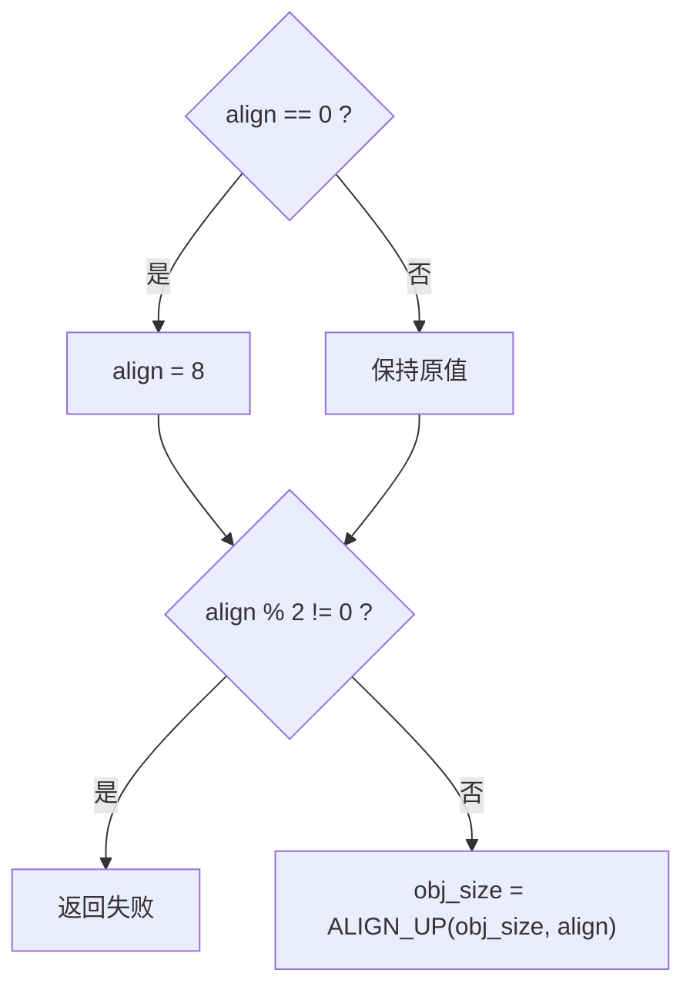

---

### 3.3 kmem_cache_grow

功能：向 cache 申请新的 slab。

流程：

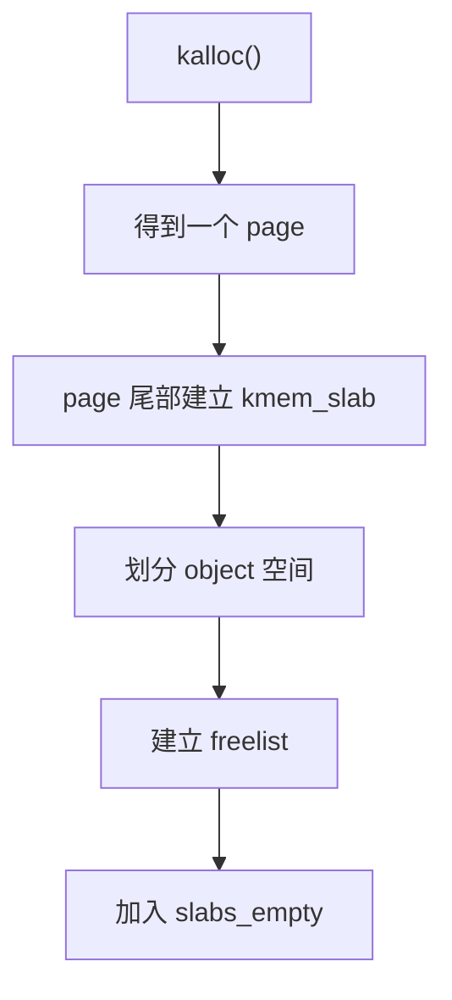

内存布局：

```
page:
+----------------+
| object0        |
| object1        |
| object2        |
|                |
| kmem_slab      |
+----------------+
```

约束：

- grow 内部获取 `kmem_cache.lock`
- 调用 grow 前不能持有 cache 锁

原因：避免双重加锁导致死锁：

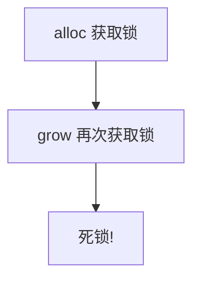

---

### 3.4 kmem_cache_alloc

功能：从 cache 中获取对象。

查找顺序（优先使用部分空闲 slab，减少空 slab 数量）：

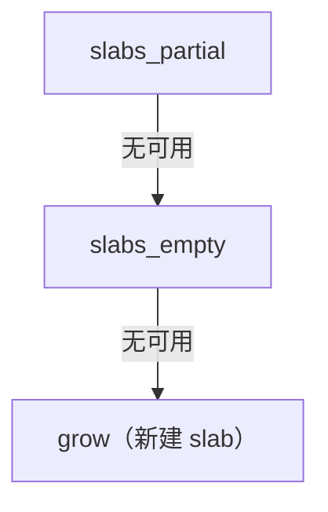

流程：

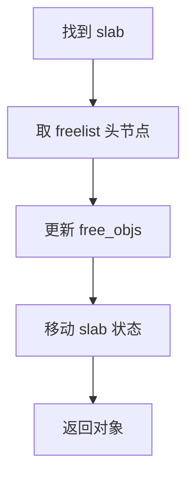

状态变化：

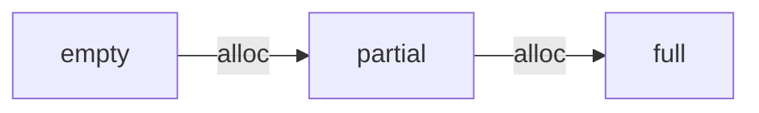

约束：调用期间需要持有 `kmem_cache.lock`。

---

### 3.5 kmem_cache_free

功能：释放对象。

由于 object 所在 page 尾部保存了 `kmem_slab`，因此可以通过对象地址定位 slab：

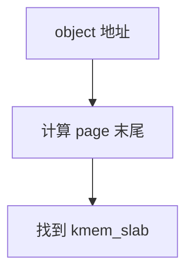

流程：

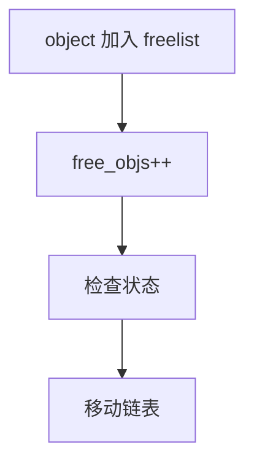

状态变化：

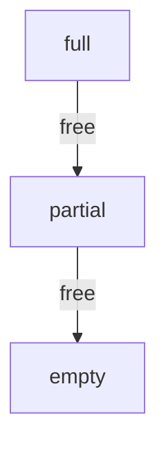

约束：调用期间需要持有 `kmem_cache.lock`。

---

### 3.6 kmem_cache_reap

功能：回收一个完全空闲的 slab。

注意：reap 不会销毁 cache，仅释放一个空 slab。

例如：

```
cache
 ├─ slab
 ├─ slab
 └─ slab

reap() 后: cache 仍存在，但释放了一个空 slab
```

流程：

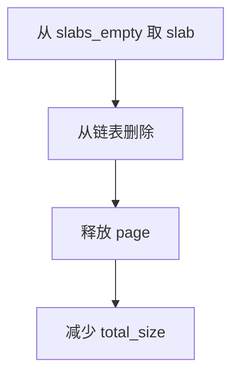

与 destroy 的区别：

| 函数      | 作用             |
| --------- | ---------------- |
| reap      | 释放部分空闲 slab |
| destroy   | 销毁整个 cache    |

---

### 3.7 kmem_cache_destroy

功能：销毁整个 cache。

前提：所有 slab 必须为空（`slabs_full` 和 `slabs_partial` 均为空），否则说明仍有对象被使用。

流程：

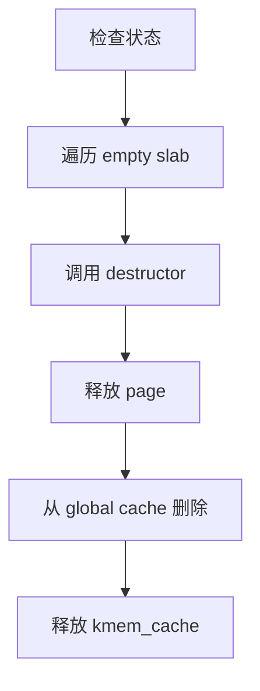

生命周期：

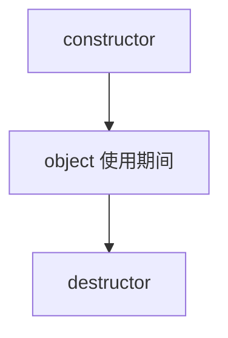

保证：`constructor 次数 == destructor 次数`。

---

## 4. 锁设计约束

### 4.1 kmem_cache.lock

保护：

- `slabs_full` / `slabs_partial` / `slabs_empty`
- `free_objs`
- `freelist`

### 4.2 slab_cache.lock

保护：

- 全局 cache 链表

### 4.3 锁顺序

正确的锁顺序：

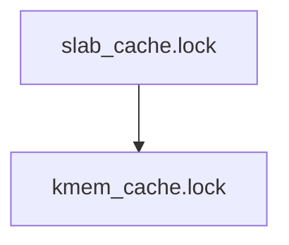

禁止（逆序会导致死锁）：

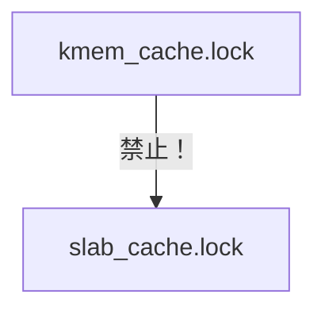
